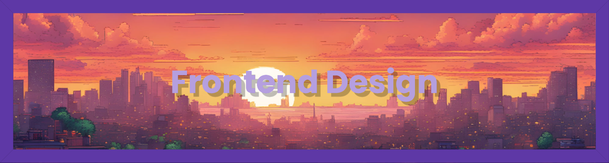

     

  <h1 align="center">Frontend Design</h1>

  

    An project aimed to improve and implement design skills using basic HTML/CSS/JS!   Some might also use external of libraries like Tailwind or DaisyUI <b>(Coming Soon) </b>  
     
    <a href="https://github.com/Twiztss/Frontend-Design"><strong>Explore the project »</strong></a>
     
     
    <a href="https://github.com/Twiztss/Frontend-Design/tree/main/Age-Calculator-App">Project Example</a>
    ·
    <a href="https://twiztss.github.io/Frontend-Design/Age-Calculator-App/">Project Preview</a>
    ·
    <a href="https://github.com/Twiztss/">Other Projects</a>
  

## About

Basically, building a website or big project can be effective in overall designing skills. However, experiencing diverse type of small project designs can improve design skills without getting burnt out from large amount of work in single projects.
- HTML/CSS/JavaScript Designs from https://www.frontendmentor.io
- These practices helps in designing websites and increasing proficiency in Frontend.

## Difficulty

- Determined according to complexity and scripts used in the design, currently on Intermediate difficulty which will try to scale up the difficulty gradually.

## Projects

- [QR Code Component](https://github.com/Twiztss/Frontend-Design/tree/main/QR-Code-Component)
- [News Homepage](https://github.com/Twiztss/Frontend-Design/tree/main/News-Homepage)
- [Social Proof Section](https://github.com/Twiztss/Frontend-Design/tree/main/Social-Proof-Section)
- [Blog-Preview-Card](https://github.com/Twiztss/Frontend-Design/tree/main/Blog-Preview-Card)

 

- [Contact Form](https://github.com/Twiztss/Frontend-Design/tree/main/Contact-Form)
- [Age Calculator App](https://github.com/Twiztss/Frontend-Design/tree/main/Age-Calculator-App)
- [Product List With Cart](https://github.com/Twiztss/Frontend-Design/tree/main/Product-List-With-Cart) (Ongoing)

 

- [Space Tourism Website](https://github.com/Twiztss/Frontend-Design/tree/main/Space-Tourism-Website) (Ongoing)

